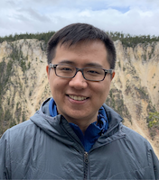

  

    

<h1>Shuai Mu</h1>
Assistant Professor  
Department of Computer Science  
Stony Brook University  
 

Office: New Computer Science RM-351  
Email: shuai at cs stonybrook edu 
Links: 
<!-- <a href="cv.pdf">CV</a>,  -->
<a href="https://scholar.google.com/citations?user=wcbyR5UAAAAJ&hl=en">Google Scholar</a>, <a href="https://calendar.google.com/calendar/embed?src=shuai%40cs.stonybrook.edu&ctz=America%2FNew_York">Calendar</a>
    

    

      
    

  

I am an assistant professor of [Computer Science](http://www.cs.stonybrook.edu) at [Stony Brook University](http://www.stonybrook.edu).
My main research interests are in distributed systems and multi-core systems.
I'm particularly interested in:
  * Building fault-tolerant storage and database systems.
  * Building tools to ease concurrent programming for developers.  
  * Verifying correctness of distributed systems and algorithms.

**I am looking for motivated PhD/MS/Undergrad students.** 
If you are interested, email me a brief resume.

## News ([see all](news.html))
* Jul 2025, Mako appeared at OSDI '25!
* Dec 2024, Received SBU Research Excellence Award. Thank you Seawolves!
* Jun 2024, CausalMesh accepted to PVLDB 24 (VLDB '25)!
* Sep 2023, Awarded LARGE (Co-PI). Thanks NSF!
* May 2023, NCC accepted to OSDI '23!
* Feb 2023, Awarded CAREER. Thanks NSF!
<!-- * Dec 2022, Waverunner accepted to NSDI '23! -->
<!-- * Aug 2022, Viper accepted to EuroSys '23! -->
<!-- * Apr 22, DepFast accepted at USENIX ATC '22! -->
<!-- * Rolis appeared at EuroSys '22!  -->
<!-- #### **Fail-slow Fault Tolerance appeared at HotOS '21!**  -->
<!-- #### **MongoDB Replication appeared at NSDI '21!** -->

## Recent courses ([see all](teaching))
* [CSE-590, Reliable System Programming, Spring 2025](./teaching/sf/25sp/)
* [CSE-416, Software Engineering, Fall 2024](./teaching/se/24fa/) 
<!-- * CSE-59X: Building Reliable Distributed Systems with Dafny, Spring 2023 -->
* CSE-416, Software Engineering, Spring 2024 
  <!-- [IMPORTANT MESSAGE TO READ BEFORE ENROLLING](./teaching/se/24sp/) -->
* [CSE-535, Distributed Systems, Fall 2023](./teaching/ds/23fa/)
* Seminar: Distributed Systems Reading Group, Fall 2023 
* Seminar: Formal Verification with Dafny, Fall 2023
<!-- * Seminar: Distributed Systems Reading Group, Summer 2023  -->
* [CSE-535, Distributed Systems, Fall 2022](./teaching/ds/22fa/)
<!-- * [CSE-416, Software Engineering, Spring 2022](./teaching/se/22sp/) -->
<!-- * [CSE-535, Distributed Systems, Fall 2020](./teaching/ds/20fa/) -->
<!-- * [CSE-535, Distributed Systems, Fall 2019](./teaching/ds/19fa/) -->
<!-- * [CSE-535, Distributed Systems, Spring 2019](https://github.com/shuaimu/ds19spring) -->
<!-- * [Computer Systems Organization, Spring 2018, NYU](./teaching/cso18spring/index.html) -->

## Recent publications ([see all](pubs.html))

  <ul>
    <li>
      CausalMesh: A Causal Cache for Stateful Serverless Computing
      [<a href="https://www.cis.upenn.edu/~sga001/papers/causalmesh-vldb25.pdf">paper</a>]
       
      Haoran Zhang, Shuai Mu, Sebastian Angel, Vincent Liu
       
      PVLDB 24, Best Paper Award Nominee
       
      ACM SIGMOD Research Highlight Award
    </li>
    <li>
    NCC: Natural Concurrency Control for Strictly Serializable Datastores by Avoiding the Timestamp-Inversion Pitfall
    [<a href="./pub/ncc-osdi23.pdf">paper</a>, <a href="https://arxiv.org/pdf/2305.14270.pdf">tr</a>]
     
    Haonan Lu, Shuai Mu, Siddhartha Sen, Wyatt Lloyd
     
    OSDI 23
    </li>
    <li>
    Viper: A Fast Snapshot Isolation Checker 
    [<a href="./pub/viper-eurosys23.pdf">paper</a>]
     
    Jian Zhang, Ye Ji, Shuai Mu, and Cheng Tan
     
    EuroSys 23
    </li>
    <li>
    Waverunner: An Elegant Approach to Hardware Acceleration of State Machine Replication
    [<a href="./pub/waverunner-nsdi23.pdf">paper</a>]
     
    Mohammadreza Alimadadi, Hieu Mai, Shenghsun Cho, Michael Ferdman, Peter Milder, and Shuai Mu
     
    NSDI 23
    </li>
    <li>
    DepFast: Orchestrating Code of Quorum Systems 
    [<a href="./pub/depfast-atc22.pdf">paper</a>, <a href="https://github.com/stonysystems/depfast-ae">code</a>] 
     
    Xuhao Luo, Weihai Shen, Shuai Mu, and Tianyin Xu
     
    USENIX ATC 22
    </li>
    <li>
    Rolis: a software approach to efficiently replicating multi-core transactions
    [<a href="./pub/rolis-eurosys22.pdf">paper</a>, <a href="https://github.com/stonysystems/rolis">code</a>] 
     
    Weihai Shen, Ansh Khanna, Sebastian Angel, Siddhartha Sen, and Shuai Mu
     
    EuroSys 22
    </li>
    <li>
    Fail-slow fault tolerance needs programming support
    [<a href="./pub/depfast-hotos21.pdf">paper</a>]
     
    Andrew Yoo, Yuanli Wang, Ritesh Sinha, Shuai Mu, and Tianyin Xu 
     
    HotOS 21
    </li>
    <li>
    Fault-Tolerant Replication with Pull-Based Consensus in MongoDB
    [<a href="./pub/mongodb-nsdi21.pdf">paper</a>]
     
    Siyuan Zhou, Shuai Mu
     
    NSDI 21
    </li>
    <!-- <li>
    Cobra: Making Transactional Key-Value Stores Verifiably Serializable 
    [<a href="./pub/cobra-osdi20.pdf">paper</a>]
     
    Cheng Tan, Changgeng Zhao, Shuai Mu, Michael Walfish
     
    OSDI 20
    </li> -->
    <!-- <li>
On the Parallels of Raft and Paxos [<a href="./pub/raft-paxos.pdf">paper</a>]
          
Zhaoguo Wang, Changgeng Zhao, Shuai Mu, Haibo Chen, Jinyang Li  
         PODC 19 
     </li> 
     <li>
Deferred Runtime Pipelining for contentious multicore software transactions
[<a href="./pub/drp-eurosys19.pdf">paper</a>, <a href="./pub/drp-tr.pdf">tr</a>]
          
Shuai Mu, Sebastian Angel, Dennis Shasha  
         EuroSys 19
     </li>  -->
     <!-- <li>
     Giza: Erasure Coding Objects across Global Data Centers
[<a href="./pub/giza-atc17.pdf">paper</a>]
      
     Yu Lin Chen, Shuai Mu, Jinyang Li, Cheng Huang, Jin Li, Aaron Ogus, Douglas Phillips 
     USENIX ATC 17
     </li> 
     <li>Consolidating Concurrency Control and Consensus for Commits under Conflicts 
         [<a href="./pub/janus-osdi16.pdf">paper</a>, 
          <a href="./pub/janus-tr.pdf">tr</a>,
          <a href="https://raw.githubusercontent.com/NYU-NEWS/janus/master/tla/Janus.tla">tla+</a>,
         <a href="https://github.com/nyu-news/janus">code</a>] 
          
	  Shuai Mu, Lamont Nelson, Wyatt Lloyd, Jinyang Li  
	  OSDI 16</li>
     <li>The SNOW Theorem and Latency-Optimal Read-Only Transactions 
         [<a href="./pub/snow-osdi16.pdf">paper</a>]  Haonan Lu, Christopher Hodsdon, Khiem Ngo, Shuai Mu, Wyatt Lloyd   OSDI 16</li>
     <li>Scaling Multicore Databases via Constrained Parallel Execution 
         [<a href="./pub/ic3-sigmod16.pdf">paper</a>,
          <a href="http://ic3.news.cs.nyu.edu/techreport16.pdf">tr</a>] 
           Zhaoguo Wang, Shuai Mu, Yang Cui, Han Yi, Haibo Chen, Jinyang Li   SIGMOD 16</li> -->
	  <!--
              <li>Extracting More Concurrency from Distributed Transactions 
                  [<a href="./pub/rococo-osdi14.pdf">paper</a>, 
                  <a href="./pub/rococo-tr.pdf">tr</a>]  <strong>Shuai Mu</strong>, Yang Cui, Yang Zhang, Wyatt Lloyd, Jinyang Li OSDI 14</li> 
	  -->
      </ul>

## Students ([see alumni](alumni))

<!-- * Reza Alimadadi (PhD, with Mike Ferdman) -->
* Zihao Zhang (Post-doc)
* [Jinkun Geng](https://www.gengjinkun.com/) (Post-doc, co-advised with Anirudh Sivaraman)
* [Weihai Shen](https://shenweihai1.github.io/) (PhD)
* [Santa Shithil](https://sites.google.com/grad.cse.buet.ac.bd/santa-maria-shithil/about) (PhD)
* Ze Tang (PhD)
<!-- * Kumar Shivam (PhD) -->
* Ti Zhou (PhD)
<!-- * Sethu Karthikeyan (MS) -->
<!-- * Chenyu Wang (MS) -->
<!-- * Saumitra Bose (MS) -->

I am also privileged to work closely with other great students including: 
<!-- * Xuhao Luo (PhD@UIUC, advised by Tianyin Xu) -->
* [Haoran Zhang](https://snowchord.com/) (PhD@UPenn, advised by Vincent Liu and Sebastian Angel) 
* [Jian Zhang](https://www.khoury.northeastern.edu/home/zhangjian3/) (PhD@Northeastern, advised by Cheng Tan)
<!-- * Hieu Mai (PhD@SBU, advised by Mike Ferdman) -->

## Program committees 
<!-- * APSys 2019, 2020, 2021 -->
* ASPLOS 2022 (ERC)
* EuroSys 2025
* ICDCS 2023
* NSDI 2021, 2023
* SIGCOMM 2023
* SOSP 2024 
* USENIX ATC 2020, 2024, 2025

<!-- ## Bio
Prior to joining Stony Brook, I spent 4 years at [NYU](http://nyu.edu) as a visiting student/post-doc/lecturer in the [Systems Group](http://news.cs.nyu.edu). 
I obtained my Ph.D. from <a href="http://tsinghua.edu.cn">Tsinghua University</a> and B.S. from <a href="http://cau.edu.cn">China Agricultural University</a>. -->
<!-- During my graduate studies, I also had the luck to be a visiting student at <a href="http://usc.edu">USC</a> and <a href="http://sydney.edu.au">University of Sydney</a>. See a full history in my [CV](cv.pdf).  -->

<!-- ## Acknowledgement
My research group is generously supported by: 

  
  

-->
<!--(Full <a href="cv.pdf">CV</a>) -->
